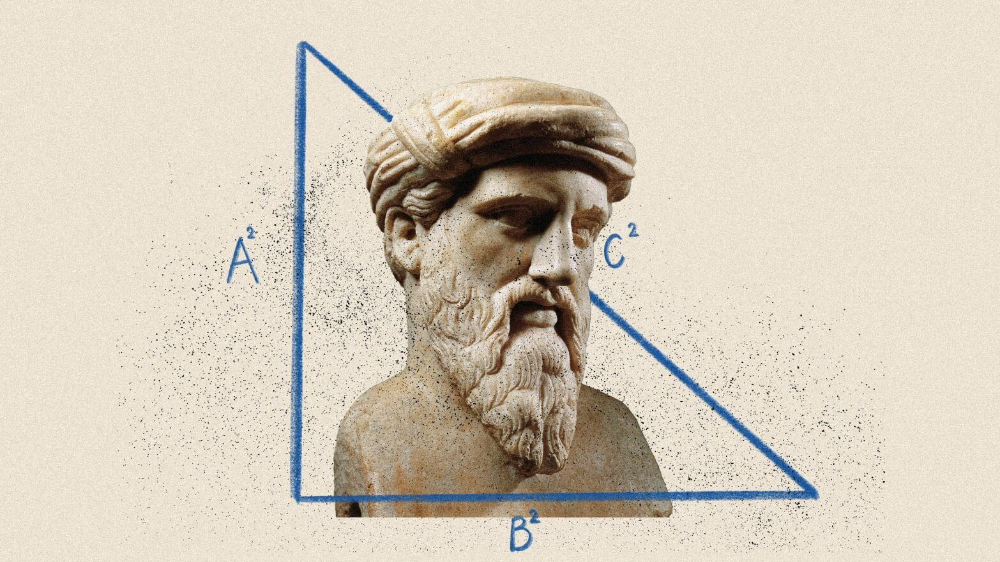

# Decred ：践行伟大思想家之路

作者：Joao Paulo Sant'Anna da Silva

> 有些项目从一开始就秉承着强大的精神和哲学。Decred 是一个从一开始就致力于创建一个去中心化和自治社区的项目。

在一个每天都有数百个新 meme 币诞生的市场中，局外人有时很难认真考虑加密货币市场。即使是那些熟悉市场动态的人，也很难相信这些币的动机除了快速获利和投机之外。

有趣的是，一些原本只是玩笑的 meme 币，在社区参与和专家开发的推动下，已经发展成为强大的网络。狗狗币 (DOGE) 就是这种现象的最好例子。DOGE 是第一个有影响力的 meme 币，现在它是加密货币行业中市值最高的货币之一。在一个富有表现力的社区的支持下，最初的实验已经变成了一项严肃的举措。

另一方面，也有一些项目从一开始就建立在强大的精神和哲学基础之上。Decred 是一个从一开始就专注于创建一个去中心化和自治社区的项目。Decred 的区块链结合了工作量证明 (PoW) 和权益证明 (PoS)，确保了网络安全透明。利益相关者对项目的方向有发言权，创造了一个辩论环境，每个决定都由许多人讨论和决定。

从哲学角度来看，Decred 不仅是一种加密货币，而且是历史发展中各种思想的体现。这些思想与思想家思考我们社会的最佳解决方案（和批评）的方式有关，涉及政府运作、权力分配以及拥有真正自由的意义等主题。让我们踏上旅程，拜访一些历史上的伟大思想家，看看他们的想法如何与 Decred 的精神和结构相关。

)
*Decred 的功能和理念简介*

## 孟德斯鸠和 Decred 的治理

夏尔-路易·塞孔达·孟德斯鸠 1689 年出生于法国波尔多一个不太传统的贵族家庭。在涉足政治之前，他曾担任律师，对法律和政府运作有深刻的理解。他因其在政治学方面具有影响力的思想而被人们铭记，他在 1748 年出版的最著名的著作《论法的精神》中阐述了这些思想。

在这本书中，孟德斯鸠详细阐述了他著名的三权分立理论，该理论塑造了现代民主治理。他认为，将政府分为三个不同的部分（制定法律、执行法律和解释法律）对于防止暴政至关重要。他的作品通过建立立法、行政和司法权力相互制衡的制度影响了许多现代民主国家。孟德斯鸠表示，这种组织可以防止一个部门获得过多的权力。

*孟德斯鸠因其著名著作《论法的精神》而被人们铭记*

孟德斯鸠的历史思想可以与 Decred 的创新治理方法进行比较，尤其是他关于权力分立和制衡的思想。Decred 与孟德斯鸠的联系在于，它创建了一个生态系统，在这个生态系统中，权力不是集中的，而是分布在不同类型的参与者之间：

矿工（行政权力）：就像行政政府部门一样，矿工负责处理交易并将新区块添加到区块链。挖矿类似于执行法律和国家正常运转所需流程的行政职责。

选民（立法权）：持有票证的社区成员可以在 Politeia 治理平台上对项目的未来进行投票。利益相关者就像立法机构一样。他们负责做出有关更新区块链规则的决策，并将资金分配给有利于项目的举措。

开发人员（司法权）：尽管两者并不直接对应，但开发人员在某种程度上与司法部门类似。他们负责升级协议，确保遵守网络规则，并实施批准的变更，就像司法部门解释和应用立法机构制定的法律一样。

“当立法权和行政权集中在同一个人或同一个行政长官团体中时，就不可能有自由；因为人们可能会担心同一个君主或参议院会制定暴虐的法律，并以暴虐的方式执行这些法律。”——引自孟德斯鸠的《论法的精神》

## 社区参与

孟德斯鸠的哲学还强调了公民参与的态度，他认为这是避免权力集中的一项基本活动。Decred 通过 Politeia 平台将这些原则带入区块链时代，用户可以在该平台提交提案、辩论和对共识变更进行投票。除了权力分散之外，这一行动还加强了系统中的民主感。在政治游戏中拥有投票权的参与者通常会更加关注所做的决定。

这种思维契合体现了 Decred 项目如何利用历史思维来增强其结构完整性。利益相关者参与模型展示了区块链技术如何用于模拟社会治理的改进。

## 尼采、Decred 和财务独立的概念

弗里德里希·尼采是一位以挑衅风格而闻名的哲学家。他想用他的叛逆精神揭露哲学前辈们所有的虚伪和道德。尼采的著作充满了深刻的自由和自决感，想要打破读者可能拥有的每一条智力或道德枷锁。最重要的是，尼采鄙视一切平庸，就像 Decred 项目在开发区块链和金融自由方面所做的那样。

Decred 寻求摆脱传统金融体系，提出一种以透明度、去中心化和自给自足为支柱的模式，成为一个想要挑战既定规范的社区。

*尼采的作品充满了对自由和自决的深刻感受*

## 赋予个人权力

Decred 赋予用户保管资金、进行交易和检查整个项目运作情况的主权。该项目提供了 DCRDEX 等工具，允许点对点交易，而无需中央权威。Decred 环境所创造的自主感反映了尼采哲学，即个人欲望是叙事的中心。

尼采提出的“Übermensch”或超人的概念象征着创造自己的价值观并且不受常识左右的人。Decred 是反映这一概念的专业人士的中心。Decred 项目的贡献者来自世界各地，共同尊重主权和自我监护权。他们是新工作模式的先驱，高度重视劳动、个人自由和隐私。

“从根本上讲，每个人都很清楚，他是一个独一无二的人，在这个世界上只有一次；而且，像他这样集多样性和统一性于一身、如此奇妙如画的人物，不可能再出现第二次。”——引自尼采的《不合时宜的沉思》

## 毕达哥拉斯：多才多艺的典范

萨摩斯岛的毕达哥拉斯是当时杰出的希腊哲学家之一。他创立了革命性的毕达哥拉斯定理，并通过毕达哥拉斯运动影响了数学以外的许多领域。毕达哥拉斯学派的成员讨论数学、音乐、哲学和灵性，一直在寻求生活中的平衡。关于他的生活和工作的大部分信息已经丢失，但他的一些贡献是如此重要，即使 2500 年也无法抹去。毕达哥拉斯相信客观真理，可以用数学原理来解释。

Decred 就像毕达哥拉斯运动一样，是一个多功能项目，远远超出了区块链的范围。毕达哥拉斯以哲学作为他所研究的所有其他科目（数学、灵性、音乐）的基础，而 Decred 则以区块链作为项目所有应用的根源。多功能性是两者的核心原则！

“有光就有黑暗；有冷就有热；有高就有深；有固体就有液体；有硬就有软；有粗糙就有光滑；有平静就有暴风雨；有顺境就有逆境；有生就有死。”——引自《毕达哥拉斯的黄金诗句及其他毕达哥拉斯残篇》

*毕达哥拉斯通过毕达哥拉斯运动影响了数学以外的许多领域*

## 应用广泛

毕达哥拉斯 是一种将科学视为单一事物的思维方式。Decred 将区块链技术视为改变人们财务生活的一种手段。Decred 开发的一些应用程序包括：

## Bison Relay

Bison Relay是社交媒体的新尝试，它是一种基于 Decred 的通信工具，可以实现言论自由、结社自由，是传统平台的替代品。Bison Relay 遵循 Decred 的隐私精神，大量使用 Decred 闪电网络，其中发送的每条消息都经过加密。使用该网络还使用户能够将其内容货币化，通过 LN 小额支付获得付款。

*Bison Relay 是 Decred 对社交媒体的新诠释*

正如毕达哥拉斯将数学、哲学、音乐和灵性等各种学科整合成一个统一的思想流派一样，Bison Relay 将通信与区块链技术相结合，以促进言论自由、结社自由和财务独立。

## DCRDEX

DCRDEX是 Decred 的去中心化交易所。DCRDEX 提供交易和存储服务，支持不同的货币，例如：比特币 (BTC) 比特币现金 (BCH) 以太坊 (ETH) USDC 莱特币 (LTC) 狗狗币 (DOGE) ZCash (ZEC) Digibyte (DGB)

DCRDEX 非常重视隐私，因此对于重视隐私的用户来说，这是一个有吸引力的选择。DCRDEX 允许用户直接从钱包进行交易，而无需中介。这种设计增强了安全性，并让用户可以完全控制自己的资金。

*了解如何使用 DCRDEX*

毕达哥拉斯认为宇宙具有内在秩序，可以通过数字及其关系来解释。他教导说，世界的和谐与平衡与数学原理息息相关。同样，DCRDEX 寻求通过平衡所有用户之间的权力来在加密交易环境中创造和谐。它消除了对中央权威的需求。这种去中心化的方法确保没有任何一个实体控制交易所，反映了毕达哥拉斯对系统平衡和公平的追求。

## 时间戳

Timestamply简化了证明数字内容存在的过程，这一功能对于需要证明的各类应用都至关重要。无论是法律文件、知识产权保护还是学术研究。

毕达哥拉斯对绝对真理怀有深深的敬意，他认为绝对真理可以通过数学概念来获得。Timestamply 提供了一种建立和验证数字内容不可变时间戳的方法，体现了毕达哥拉斯对真理的追求。

## 向前进

哲学是一切知识和科学的基础。如果没有思考和质疑的能力，人类就无法在数学、社会学、生物学甚至精神领域取得进步。

Decred 是一个建立在与历史思想相关的价值观和理念之上的倡议的典范。Decred 是哲学概念如何转化为现代技术创新的典范。Decred 借鉴了质疑、批判性思维和社区治理的哲学传统，建立了一个强调透明度、自主性和治理的加密货币系统。

## 关于译者

编译 ：[@Dominic](https://twitter.com/wanbihou)

