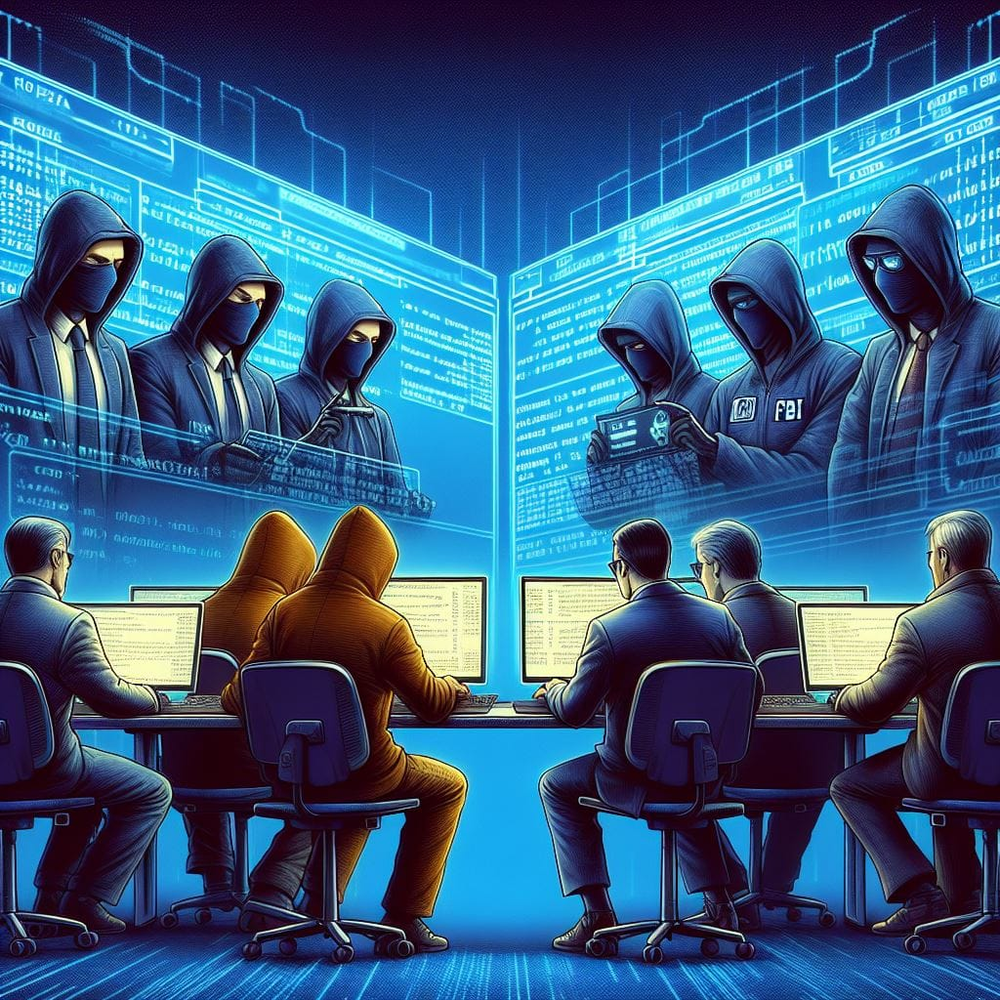
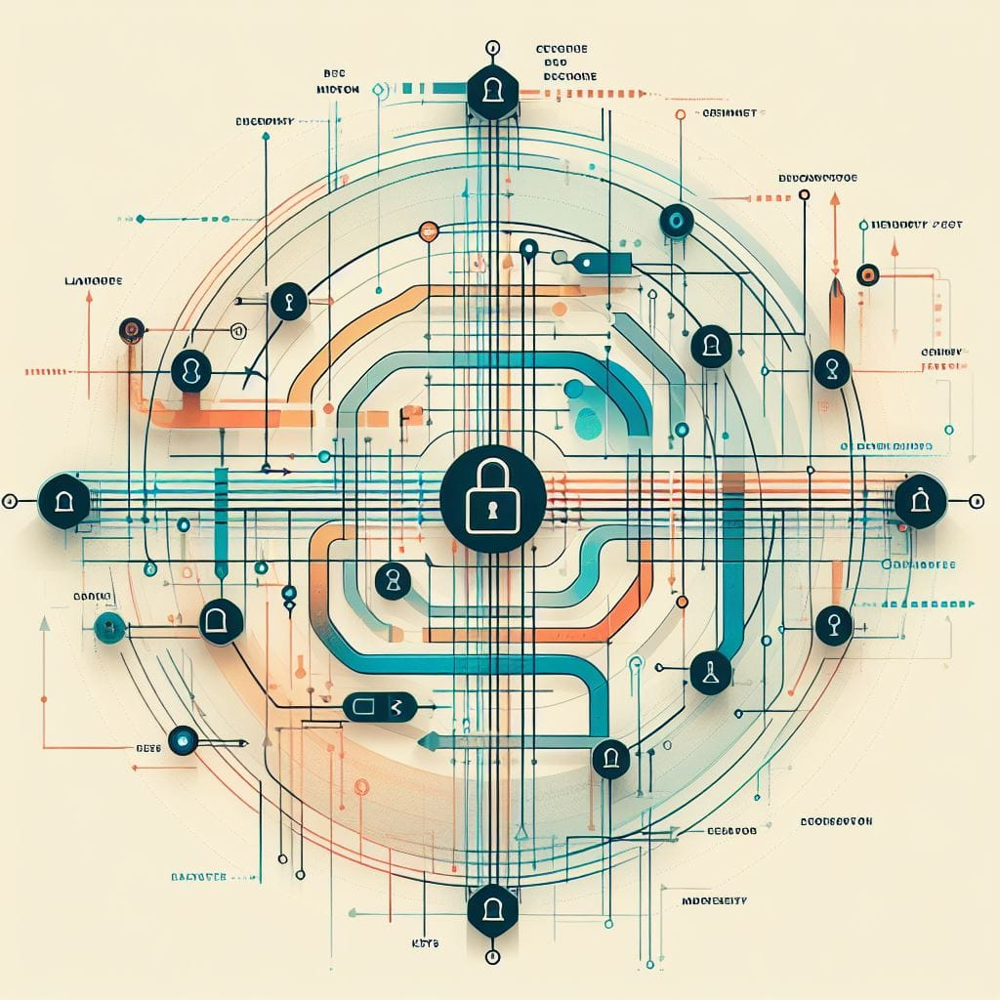
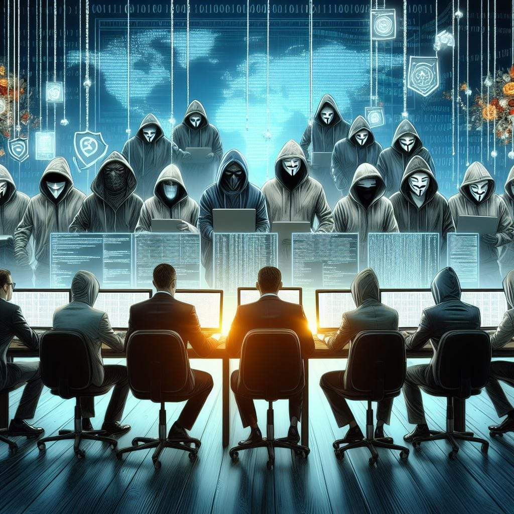

# 解读第一次加密战争的戏剧

作者：TALL AMERICANO

> 审视历史背景、密码朋克的崛起、立法斗争以及对全球加密政策的持久影响。

## 90年代第一次加密战争简介：

在互联网的早期，一场无声却深刻的斗争在表面下展开，这场斗争将成为当今加密货币领域的基石。这场冲突的核心是密码学。这场历史性的对抗被称为第一次加密战争，汇集了各种各样的参与者：才华横溢的数学家、专注的密码朋克和坚韧的政府特工。每个人都试图影响网络空间的命运。

这场战争仍然是一个有趣的篇章，充满了戏剧性的事件和重要的参与者，他们的贡献在当今加密货币世界的基础上产生了共鸣。

## 第一次加密货币的关键参与者

密码学在 90 年代经历了重大进步，引起了广泛的关注。像密码朋克和公民自由支持者这样的团体出现了，主张使用加密来保护在线隐私和自由。美国政府内部出现了担忧，担心不受监管的加密可能会为犯罪分子和恐怖分子提供支持。

这场隐私斗争的主要参与者是：

* 美国政府：克林顿政府和包括国家安全局 (NSA) 在内的情报机构积极寻求加强对加密技术和监视能力的控制。他们的主要目标是维护国家安全和打击犯罪活动。

* 隐私倡导者：电子前沿基金会 (EFF) 和美国公民自由联盟 (ACLU) 等组织坚决反对政府限制加密的努力。他们将这些尝试视为对个人自由和隐私的侵犯，因此不懈地努力促进使用加密来维护权利。

* 密码学研究人员、爱好者和密码朋克：菲尔·齐默尔曼等有远见的人在倡导加密使用并抵制政府限制方面发挥了关键作用。密码朋克是一个由密码学倡导者、技术专家和活动家组成的松散团体，他们热情拥护密码学在保护公民自由、隐私和言论自由方面的能力。

## PGP 的出现和隐私十字军

PGP 由 Phil Zimmermann 开发，成为密码朋克运动致力于为个人提供加密工具的象征。PGP 于 1991 年发布，允许人们加密信息，从而彻底改变了加密通信。该软件结合使用了对称密钥加密技术和公钥加密技术。当用户使用 PGP 发送消息时，软件会为该特定消息生成随机对称密钥，从而加密其内容。同时，PGP使用接收者的公钥来加密随机生成的对称密钥。这种双层加密过程确保了安全通信。

**PGP 的创始人菲尔·齐默尔曼 (Phil Zimmerman)：“如果隐私被取缔，那么只有不法之徒才会拥有隐私。”**

PGP 加密或 Pretty Good Privacy 加密是 ***一种数据加密计算机程序，可为在线通信提供加密隐私和身份验证。*** 它通常用于加密和解密文本、电子邮件和文件，以提高电子邮件的安全性。

## Clipper 芯片提案

随着密码朋克和 PGP 加密工具的发展势头，美国政府越来越担心广泛使用密码技术的潜在后果。Clipper 芯片成为数字隐私运动的主要对手。1993年，克林顿政府推出了Clipper Chip作为专为电信系统设计的硬件加密设备。虽然该芯片充当了保护电话通信安全的加密工具，但它有一个规定——由政府机构保留的私钥。该密钥使他们能够解密和访问由芯片加密的任何通信，但仅限于法律授权（例如法院命令）。这种设置旨在取得平衡，允许执法和情报机构在必要时并经法律程序授权时访问解密密钥。

政府主张密钥托管和执法部门获取加密密钥的主张源于对国家安全和执法能力的担忧。美国政府，特别是克林顿政府和国家安全局 (NSA) 等情报机构认为，不受监管的加密可能会为犯罪分子和恐怖分子提供不受监视的安全通信渠道，从而为他们提供帮助。密钥托管的概念涉及将加密密钥的副本存储在受信任的第三方（通常是政府机构）处，以确保可以在合法情况下（例如在刑事调查期间）访问这些密钥。

**公众的强烈反对和异议**

这一提议遭到了隐私倡导者的强烈反对。电子前沿基金会 (EFF) 和美国公民自由联盟 (ACLU) 等组织认为，这种密钥托管系统对隐私构成了重大威胁。密码朋克强烈反对政府任何控制或监管加密的尝试。他们将加密视为保护隐私和促进言论自由的重要工具。

政府推动密钥托管与隐私倡导者和密码朋克的反对之间的冲突导致了立法斗争。这场辩论以旨在控制加密技术的使用和出口的拟议法规和政策的形式展开。最显着的例子是 Clipper Chip。

## 第一次加密战争的全球影响

加密战争并不局限于美国境内；其影响波及全球，塑造了国际上对数字隐私和加密的看法。当美国政府努力解决密码学监管问题时，其他国家既成为合作者，也成为抵制者。

**其他国家的合作与抵制：**

各国都饶有兴趣地观察着美国对加密技术的控制。一些国家选择与美国合作，使其政策与政府在加密限制方面的立场保持一致。这种合作通常源于对国家安全和不受监管的加密带来的威胁的共同担忧。

相反，其他国家抵制加密控制的推动。注重隐私的国家和主张不受限制地使用加密工具的国家反对美国政府限制个人自由的尝试。密码学被视为保护公民自由的工具，成为国际上关于隐私权与国家安全之间平衡的争论的焦点。

**思考冲突的意义：**

这场冲突引发了全球对限制或采用加密技术影响的思考。世界各国政府和公民开始考虑个人隐私与集体安全需求之间的微妙平衡。这场冲突引发了有关数字权利本质的根本问题，促使各国评估自己有关加密使用和监管的政策。

保护隐私的斗争在今天和未来仍在继续！

## 解决方案和后果

战争并没有以明确的解决方案结束，而是为持续的讨论和发展奠定了基础。虽然实施了某些政策，但冲突刺激了密码实践和法规的不断发展。各国认识到其重要性，在随后的几年里重新审视了他们对加密的立场。

全世界越来越认识到加密在保护个人隐私方面的重要作用。这场冲突促使叙事发生转变，许多国家承认需要对加密法规采取平衡且尊重权利的方法。其回声继续引起共鸣，影响着有关数字权利、加密以及安全与个人自由之间微妙相互作用的国际讨论。

## 第一次加密战争如何影响当前

**与现代问题的联系：**

政府引入密钥托管系统的尝试与当前的讨论有相似之处，当局提倡建立在执法必要时提供对加密数据的访问的机制。

**隐私问题：**

随着技术的进步，风险比以往任何时候都更高。大规模监控、数据泄露和个人信息收集等问题占据了头条新闻。在国家安全需要和个人隐私权之间划清界限的根本问题仍然存在。

## 关于加密重要性的最终想法

加密的重要性仍然至关重要。加密作为隐私的基石，仍然是防止无理入侵的保障措施和保护个人权利的关键。

我们面临的现代挑战（从在线隐私到日益复杂的网络威胁）凸显了加密的持续相关性。当我们参与由过去的教训所形成的当代辩论时，战争提醒我们，隐私原则和负责任地使用加密技术对于维护自由和安全的数字社会的本质是不可或缺的。

## 关于译者

编译 ：[@Dominic](https://twitter.com/wanbihou)

欢迎反馈至[Github](https://github.com/DominicTing)或联系作者

原文链接：[原文](https://www.cypherpunktimes.com/decoding-the-drama-of-the-first-crypto-war/)

