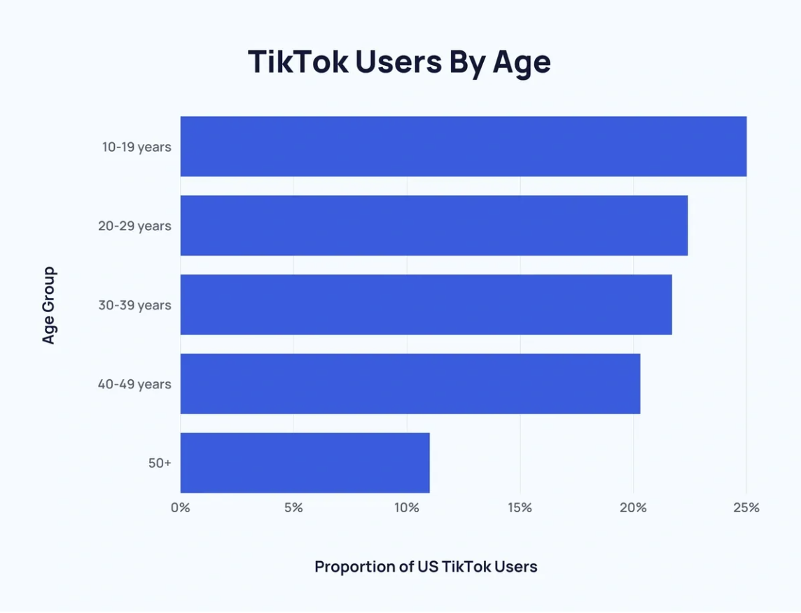

# TikTok：可能的禁令、隐私问题以及去中心化平台的潜力

作者：Joao Paulo Sant'Anna da Silva

> TikTok 是否真的对用户隐私和数据安全构成威胁，或者潜在禁令背后是否有潜在动机？ TikTok 的隐私政策与美国社交媒体公司的隐私政策相比如何？对于关注隐私的用户来说，还有哪些替代方案？

TikTok 风靡全球，它以其独特的视频（主要是短片）内容平台重新定义了社交媒体格局。起源于中国北京，由字节跳动公司控制的TikTok于2018年一经推出，就迅速占领了全球数百万人的屏幕，尤其是年轻一代，其47.4%的用户年龄在10-29岁。凭借令人上瘾的算法，TikTok 克服了地理、文化和语言障碍，成为娱乐和趋势的中心。

它在塑造数字文化、影响消费者行为和创建在线社区方面发挥着重要作用，使其成为当今最具影响力的社交媒体平台。然而，这一地位也让 TikTok 受到美国监管机构的严格审查，导致最近的立法行动可能会重新定义其在美国的运营自由度。

3 月 13 日，众议院批准了一项法案，美国朝着可能禁止 TikTok 的方向迈出了重要一步。这项立法要求 TikTok 背后的中国公司字节跳动必须出售其在该应用程序中的股份，否则将被美国应用商店驱逐。众议院的许多立法者表示担心该应用程序可能使中国政府能够获取用户数据并对美国人施加影响。

TikTok 是否真的对用户隐私和数据安全构成威胁，或者潜在禁令背后是否有潜在动机？ TikTok 的隐私政策与美国社交媒体公司的隐私政策相比如何？对于关注隐私的用户来说，还有哪些替代方案？这些问题对于理解社交媒体当前的格局以及围绕数据隐私的担忧至关重要。让我们深入研究它们，以更好地掌握社交媒体对现代数字隐私的危险。

## 为什么 TikTok 会被禁止？

美国国会批准的法案表明了其目的：

“保护美国的国家安全免受外国对手控制的应用程序构成的威胁，例如 TikTok 和任何其它应用程序或服务以及字节跳动有限公司或字节跳动控制下的实体开发或提供的任何其他应用程序或服务有限公司”

共和党和民主党立法者以及情报机构都担心字节跳动可能会将美国 TikTok 用户的数据交给中国政府。这些担忧并非夸大其词，因为美国拥有 1.7 亿活跃 TikTok 用户，而且中国的国家安全法要求企业协助国家情报行动。

TikTok 否认了这些可能有助于中国情报行动的说法。字节跳动表示，从未与中国当局共享美国用户的数据。尽管存在怀疑，美国政府仍然没有证据表明 TikTok 与中国官员分享了此类信息。

TikTok首席执行官在美国国会作证

该法案仍需参议院批准才能执行，但如果真的执行，字节跳动有两个选择：出售 TikTok 或面临运营禁令。如果选择出售，在白宫证明该应用程序不再受到外国对手的控制后，该应用程序仍然可以在美国运行。该立法还规定，字节跳动必须放弃对 TikTok 算法的控制权，该算法以令人上瘾而闻名。

## TikTok 隐私问题

人们使用 TikTok 的原因有多种，包括娱乐、追随潮流、学习新事物、分享个人经历、艺术表达自己以及营销或发展个人或商业品牌。然而，该平台也因众多隐私问题而面临严厉批评。

TikTok 的数据收集做法涉及收集敏感用户信息，通常未经明确同意。这包括个人设备详细信息、浏览历史记录、击键模式、无线连接、地理位置、个人身份信息 (PII)、生物识别数据（例如面部和语音识别）以及消息内容。您可以在这里阅读平台的隐私政策！

该应用程序的隐私政策允许进行广泛的数据分析，引发了人们对用户隐私和安全的担忧，特别是考虑到这些数据可能因法律义务而被中国政府访问。尽管保证数据存储在美国和新加坡，但 TikTok 与中国基础设施的连接表明，用户数据可能会与中国当局共享。美国缺乏严格的数据隐私联邦法律，这使得 TikTok 能够以最低限度的监管收集和使用个人数据，这与欧洲等其他地区更强有力的保护形成鲜明对比。这种情况引起了美国政府和网络安全专家对隐私和国家安全影响的严重担忧。

然而，美国可能实施的禁令的核心超出了这些担忧。这种动态是针对中国不断发展的科技行业和不断升级的紧张局势而展开的，一些人将其描述为新冷战。这种竞争的关键要素包括人工智能优势的竞争以及微芯片制造和云计算服务可用性的冲突。

## 美国社交媒体如何对待隐私

对于那些担心个人信息和互联网行为安全的用户来说，TikTok 无疑是一场隐私噩梦。但社交媒体用户不应仅将担忧集中在 TikTok 上，还应关注其他社交媒体公司。自从斯诺登泄密以来，我们知道美国国家安全局（NSA）通过与美国主要科技和互联网公司的“合作伙伴关系”来运行监视计划。

爱德华·斯诺登透露了许多有关美国国家安全局监视的细节

Google、X 和 Meta 等主要科技公司也因收集用户的个人信息而闻名。他们表示有必要改善其平台上的用户体验，但其中很大一部分都是关于销售在人们居住的地方打动他们的广告。问题是，当他们收集有关我们的种族、民族、我们所爱的人或其他个人信息的信息时，可能会导致我们陷入一些危险的境地。以 Meta 为例。他们最近不得不与美国司法部达成协议，因为他们的算法让广告商将某些种族群体排除在外，看不到有关住房、就业和银行业的重要广告。我们不要忘记他们在 2018 年收到的 50 亿美元罚款。联邦贸易委员会发现他们对用户数据的保管并不十分谨慎。这一切都因为与一家名为 Cambridge Analytica 的英国公司的不正当交易而爆发。 Meta 试图解决其中一些问题，但这只是表明收集所有这些敏感数据可能会导致一些严重的问题。

这凸显出，美国社交媒体巨头，就像中国公司字节跳动一样，对用户隐私构成了重大威胁。尽管来自不同的国家，但他们处理用户数据的方法却显示出严重的相似之处。两者都涉及个人信息管理以及与政府机构的可疑互动方面的争议。这种相似之处凸显了科技行业内的一个全球性问题，即隐私的界限不断受到考验，而这往往以牺牲个人用户的利益为代价。

## 社交媒体有安全的选择吗？

在以社交媒体为中心的世界中，没有社交媒体，人们很难生活。想要社交是人类的自然条件，但是当我们关心自己的数据和隐私时，我们该怎么办？

这个问题很复杂，但仍然有希望！有各种开源、以隐私为中心的点对点解决方案可供使用。本讨论探讨了这些替代方案以及它们旨在解决的特定挑战。

### Bison Relay 

Bison Relay 是 Decred 项目对社交媒体的新尝试。这是一个强调言论自由、隐私和去中心化的新平台。它采用异步客户端-服务器协议运行，利用 Decred 闪电网络进行小额支付。使用 Bison Relay 发送的每条消息都经过加密！

这种创新的社交媒体将支付、消息传递和数据安全集成到一个平台中。它是一款支持类似于 Facebook/Twitter 功能的软件，用户可以在其中发布内容、订阅用户的帖子和评论。让我们更深入地了解 Bison Relay 的其他一些有趣的功能：

* 言论自由和自由结社：用户可以自由交流，而不必担心审查，享受加密消息和元数据最小化的好处。该平台仅收集运营所需的最少信息！

* 加密和隐私：所有消息均使用端到端加密进行加密。该工具确保只有预期的收件人才能阅读内容。

* 去中心化和点对点网络：Bison Relay 不依赖集中式服务器来传输消息和处理用户帐户。它本质上是一个点对点加密内容中继网络。这最大限度地减少了监视的风险。

总之，Bison Relay 提供了畅快沟通的可能性。它强调用户主权，提供与 Decred 加密货币集成的加密且注重隐私的平台。

### Mastodon

Mastodon 是一个与 Twitter 非常相似的社交平台，但其结构强调隐私、用户控制和社区治理。 Mastodon 不是由一个公司拥有一个单一的中央服务器，而是由多个独立的服务器组成，每个服务器都有自己的规则、策略和社区焦点，这个系统被称为“联合模型”。

这种结构允许用户加入符合其兴趣、价值观和所需隐私级别的群组。这是一种可定制的体验，支持高级隐私设置，您可以在其中调整每个出版物的隐私级别。

## 展望未来

随着一些用户意识到他们的在线状态和数据使用的安全和隐私影响，Bison Relay 和 Mastodon 等替代方案提供了更多元化的选择。字节跳动和 Meta 等大公司已经被揭露为真正的隐私噩梦，并且对任何担心其数据安全的人来说都是一个风险。

社交媒体尽头的曙光可能是注重隐私和以用户为中心的平台的崛起。普通民众仍然需要更多地认识到数据滥用和个人信息泄露的危险。密码朋克社区必须致力于这一学习过程，传播有关互联网隐私和数据安全重要性的知识。如果一切顺利，我们就可以走向更加去中心化和自由的未来。

## 关于译者

编译 ：[@Dominic](https://twitter.com/wanbihou)

欢迎反馈至[Github](https://github.com/DominicTing)或联系作者

原文链接：[原文](https://www.cypherpunktimes.com/tiktok-on-the-clock-the-possible-ban-privacy-concerns-and-the-potential-of-decentralized-platforms/)
